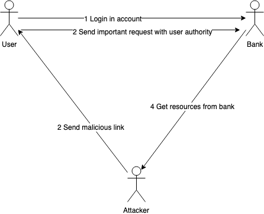
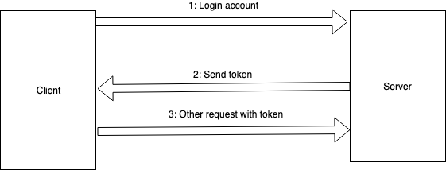

# CSRF Attack (Cross-site request forgery)

## Introduction

Attacker can send some malicious requests to websites that user has authorized by using XSS.
This attack is called CSRF attack. XSS is often used to do CSRF attack, but it's not the only
way. 

For example, let's say we have a BBS website and user uploads his posts by sending a
GET request:

```
http://example.com/bbs/upload_post?title=MyTitle&content=SomeContentHere
```

Now if the attacker place a link: 

```html
<a href="http://example.com/bbs/upload_post?title=MyTitle&content=SomeContentHere">Click Me</a>
```

in his hacker website, user will upload a post by clicking this link. Because user has already
logged in their account, that post will be created and uploaded by the user.



This is just a simple example of CSRF. Forging a malicious uploading post request means attacker
can also forge other huge-effect request, such as deleting posts, transferring money, updating password and etc.

## Simulation

To simulate CSRF attack, we develop a basic scenes in the tab demo website. You can click "XSS" tab 
to view it.

Clicking CSRF tab (https://haixiang6123.github.io/security-demo/#/csrf), there will be a log in web page for 
user to login their account. After user log in their account, the attacker website will send a notification to let user
click that link (http://bank.example/withdraw?account=Bob&amount=1000000&for=Evil). By Clicking the malicious link, user will send a GET request to bank and withdraw 1000000 to send to attacker Evil.


## Solution

CSRF attack can't be avoided perfectly, because request can be implemented by many ways and can be forged by many ways.
But still, we have several ways to prevent it.

### Use POST method

The simulation shows how attacker steal money by sending a GET request directly to bank.
But if we use POST method to implement this request, attacker can't forge user to click a link and
send request directly. Instead, attacker has to build up the POST request to do attack. Also,
we have other ways to prevent from POST request attack.

### Use token

After user logs into account, server will generate a token and set it in client side. Next time,
user sends other request, it will bring that token to server. Then server can use that token to
validate user identity. Even though attacker can forge a POST request, he can't get resources from server,
because attacker won't send the token to server to validate his identity.



```java
HttpServletRequest req = (HttpServletRequest) request; 
HttpSession s = req.getSession(); 
 
// Get csrf token from reqeust
String sToken = (String) s.getAttribute(“csrftoken”); 
if (sToken != null){
   // Get token from header
   String xhrToken = req.getHeader(“csrftoken”); 
   // Get token from request
   String pToken = req.getParameter(“csrftoken”); 
   // check token
   if(sToken != null && xhrToken != null && sToken.equals(xhrToken)){ 
       chain.doFilter(request, response); 
   }else if(sToken != null && pToken != null && sToken.equals(pToken)){ 
       chain.doFilter(request, response); 
   }else{ 
       request.getRequestDispatcher("/error").forward(request,response); 
   } 
} 
else { 
   // Put token in session
   sToken = generateToken(); 
   s.setAttribute(“csrftoken”,sToken); 
   chain.doFilter(request, response); 
}
```

### Set Referer

According to HTTP, there is a field called Referer which marks down who sends that request.
For server side, what it needs to do is to check the referer for each request.

```java
// Get Referer from HTTP header
String referer=request.getHeader("Referer"); 
// Check if Referer starts with bank.example
if ((referer != null) && (referer.trim().startsWith("bank.example"))){ 
   chain.doFilter(request, response); 
}
else { 
   request.getRequestDispatcher("/error").forward(request,response); 
}
```
